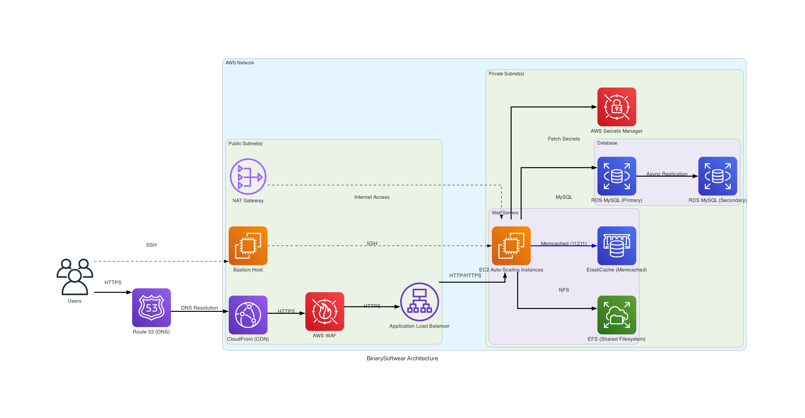

# BinarySoftwear: Cloud-Native E-commerce Platform on AWS with Terraform

---

## Executive Summary

Welcome to the BinarySoftwear project! This repository represents a comprehensive demonstration of deploying and managing a **production-grade e-commerce web application** ([BinarySoftwear.com](https://binarysoftwear.com/)) entirely on **Amazon Web Services (AWS)**. The infrastructure is meticulously defined and automated using **Terraform**, adhering strictly to **Infrastructure as Code (IaC)** principles.

The project showcases the successful migration of a WordPress/WooCommerce application from traditional hosting to a modern, **highly available, scalable, secure, and performance-optimized AWS environment**. It serves a **twofold nature as a LIVE SITE** for my new streetwear brand dedicated towards IT Professionals and Nerds like myself while **also a practical portfolio piece, highlighting expertise in cloud architecture, automation, security, cost optimization, and full-stack deployment practices relevant for DevOps, Cloud Engineering, and Infrastructure roles**.

**Live Site:** [https://binarysoftwear.com/](https://binarysoftwear.com/)

---

## Table of Contents

*   [Project Goals](#project-goals)
*   [Key Features](#key-features)
*   [Technical Architecture](#technical-architecture)
    *   [Architecture Diagram](#architecture-diagram)
    *   [Core Components Breakdown](#core-components-breakdown)
*   [Technology Stack](#technology-stack)
*   [Infrastructure as Code (IaC) with Terraform](#infrastructure-as-code-iac-with-terraform)
*   [Security Implementation](#security-implementation)
*   [Performance Optimization Strategy](#performance-optimization-strategy)
*   [High Availability and Scalability](#high-availability-and-scalability)
*   [Cost Optimization Measures](#cost-optimization-measures)
*   [Project Structure](#project-structure)
*   [Deployment Process](#deployment-process)
*   [Migration Details](#migration-details)
*   [Future Enhancements](#future-enhancements)
*   [Contact](#contact)

---

## Project Goals

*   **Cloud Migration:** Successfully migrate an existing WordPress/WooCommerce e-commerce site to AWS.
*   **Infrastructure Automation:** Implement the entire AWS infrastructure using Terraform for repeatability, version control, and automated provisioning.
*   **High Availability:** Design an architecture resilient to single Availability Zone failures using Multi-AZ deployments for critical components (EC2 ASG, RDS, EFS).
*   **Scalability:** Ensure the application can handle fluctuating traffic loads automatically via EC2 Auto Scaling.
*   **Performance:** Optimize application load times and responsiveness through a multi-layered caching strategy (CloudFront CDN, ElastiCache Memcached) and resource tuning.
*   **Security:** Implement robust security measures following AWS best practices, including network isolation, least-privilege access, WAF protection, and secure credential management.
*   **Cost-Effectiveness:** Utilize AWS services and features (e.g., Spot Instances, right-sizing) to manage operational costs efficiently.
*   **Operational Excellence:** Create a well-documented, maintainable, and production-ready cloud environment.

---

## Key Features

**Application (WordPress/WooCommerce):**

*   **E-commerce Storefront:** Online catalog for computer-centric streetwear.
*   **Shopping Cart & Checkout:** Standard WooCommerce functionality.
*   **User Accounts:** Customer registration and order history.
*   **Payment Processing:** Secure payments via Stripe integration (*assumed*).
*   **Content Management:** Standard WordPress CMS capabilities.

**Infrastructure (AWS/Terraform):**

*   **Automated Provisioning:** Entire environment deployable via `terraform apply`.
*   **Version Controlled:** Infrastructure changes tracked via Git.
*   **Resilient Design:** Multi-AZ architecture minimizes single points of failure.
*   **Dynamic Scaling:** Compute capacity adjusts automatically based on real-time CPU load.
*   **Global Content Delivery:** CloudFront CDN ensures fast asset loading worldwide.
*   **Accelerated Application Performance:** ElastiCache Memcached significantly reduces database load and speeds up dynamic content.
*   **Layered Security:** Defense-in-depth approach using WAF, Security Groups, private subnets, and Secrets Manager.
*   **Managed Services:** Leverages AWS managed services (RDS, ElastiCache, EFS, ALB) to reduce operational overhead.

---

## Technical Architecture

The architecture is designed following the AWS Well-Architected Framework principles, prioritizing security, reliability, performance efficiency, cost optimization, and operational excellence.

### Architecture Diagram

*(Diagram generated via `python binarysoftwear-infra/documentation/aws_architecture.py`)*

### Core Components Breakdown

1.  **DNS & CDN (Route 53 & CloudFront):** User requests for `binarysoftwear.com` hit Route 53, which resolves to the CloudFront distribution. CloudFront serves cached static assets (CSS, JS, images) from edge locations globally and forwards dynamic requests to the origin. A global AWS WAF policy is applied at this layer for edge security and rate limiting.
2.  **Load Balancing (ALB):** The Application Load Balancer, residing in public subnets across multiple AZs, receives requests from CloudFront. It terminates HTTPS (using ACM certificates), performs health checks, and distributes traffic across the healthy EC2 instances in the private subnets based on configured rules and target groups. A regional AWS WAF policy is attached for origin protection.
3.  **Compute (EC2 Auto Scaling Group):** An Auto Scaling Group manages EC2 instances across multiple private subnets.
    *   **Instances:** Run Amazon Linux 2 with Apache, PHP 8.2, and necessary extensions (incl. Memcached client).
    *   **Launch Template:** Defines the instance configuration, including a comprehensive User Data script for automated setup (OS config, web server, PHP, EFS mount, WordPress install/config, W3 Total Cache config).
    *   **Scaling:** Uses a mixed-instances policy (t3.small + Spot alternatives) for cost optimization and scales based on CloudWatch CPU utilization alarms.
    *   **IAM Role:** Grants necessary permissions to access Secrets Manager and EFS.
4.  **Database (RDS MySQL):** A Multi-AZ RDS instance running MySQL 8.0 provides high availability for the database. It resides in private subnets and is only accessible from the EC2 instances via its dedicated Security Group. Optimized parameter groups enhance performance. Automated backups are enabled.
5.  **Caching (ElastiCache Memcached):** A Memcached cluster deployed in private subnets provides fast in-memory caching for database queries and PHP objects, drastically reducing database load and speeding up WordPress. Integrated via the W3 Total Cache plugin on the EC2 instances.
6.  **Shared Storage (EFS):** An Elastic File System (EFS) volume, configured for high throughput (maxIO, Provisioned), provides shared storage for the entire WordPress installation (`/var/www/html`), ensuring consistency across all EC2 instances in the ASG. Mount targets exist in each private subnet for high availability.
7.  **Networking (VPC):** A custom VPC with public and private subnets across two Availability Zones forms the network foundation. Public subnets host internet-facing resources (ALB, NAT GW, Bastion), while private subnets host secure backend resources (EC2, RDS, ElastiCache).
8.  **Outbound Connectivity (NAT Gateway):** A NAT Gateway in a public subnet allows instances in private subnets to initiate outbound connections to the internet (e.g., for updates, external APIs) without exposing them to inbound traffic.
9.  **Security & Credentials (WAF, Security Groups, Secrets Manager):** Security Groups enforce strict firewall rules between components. AWS WAF protects against common web attacks. Secrets Manager securely stores and manages database credentials, retrieved dynamically by EC2 instances at boot time.
10. **Secure Access (Bastion Host):** A dedicated EC2 instance in a public subnet serves as a hardened jump box for secure SSH access to the application instances residing in the private subnets.

*(For granular details on each resource configuration, please refer to the Terraform code and README within the `binarysoftwear-infra/` directory.)*

---

## Technology Stack

*   **Cloud Provider:** Amazon Web Services (AWS)
*   **Infrastructure as Code:** Terraform (v1.2+)
*   **Application Framework:** WordPress (Latest)
*   **E-commerce Engine:** WooCommerce
*   **Web Server:** Apache HTTP Server
*   **Backend Language:** PHP (v8.2)
*   **Database:** MySQL 8.0 (AWS RDS Multi-AZ)
*   **In-Memory Cache:** Memcached (AWS ElastiCache)
*   **Shared File Storage:** AWS EFS (Elastic File System)
*   **Load Balancer:** AWS Application Load Balancer (ALB)
*   **CDN:** AWS CloudFront
*   **DNS:** AWS Route 53
*   **Web Application Firewall:** AWS WAFv2 (Regional & Global)
*   **Secrets Management:** AWS Secrets Manager
*   **SSL Certificates:** AWS Certificate Manager (ACM)
*   **Monitoring:** AWS CloudWatch (Metrics & Alarms)
*   **Compute:** AWS EC2 (Auto Scaling Groups, Launch Templates, Spot Instances)
*   **Networking:** AWS VPC, Subnets, Security Groups, NAT Gateway, Internet Gateway
*   **Operating System:** Amazon Linux 2
*   **Diagramming:** Python `diagrams` library

---

## Infrastructure as Code (IaC) with Terraform

Terraform was chosen as the IaC tool for its declarative approach, mature AWS provider, state management capabilities, and modular design potential.

*   **Declarative Configuration:** Defines the *desired state* of the infrastructure, letting Terraform figure out the execution plan.
*   **State Management:** `terraform.tfstate` (managed locally in this setup, ideally use remote state like S3 for collaboration/production) tracks resource provisioning.
*   **Modularity:** Configuration is broken down into logical files (`vpc.tf`, `rds.tf`, `ec2_asg.tf`, etc.) within the `binarysoftwear-infra/` directory for better organization and maintainability.
*   **Version Control:** Enables tracking infrastructure changes alongside application code in Git, facilitating rollbacks and audits.
*   **Repeatability:** Ensures consistent environment creation across deployments.

---

## Security Implementation

Security is paramount and implemented across multiple layers:

*   **Network Isolation:** Private subnets protect backend systems (EC2, RDS, ElastiCache) from direct internet exposure. Public subnets host only necessary internet-facing resources (ALB, NAT GW, Bastion).
*   **Firewalls (Security Groups):** Strict, stateful firewall rules are defined per component, adhering to the principle of least privilege. For instance:
    *   RDS only allows MySQL traffic from the EC2 Security Group.
    *   EC2 only allows HTTP/S from the ALB Security Group and SSH from the Bastion Security Group.
    *   ElastiCache only allows Memcached traffic from the EC2 Security Group.
*   **Web Application Firewall (AWS WAF):** Protects against common web exploits (OWASP Top 10) like SQL injection and cross-site scripting. Rules applied at both CloudFront (edge) and ALB (origin). Includes AWS Managed Rules and custom rules (e.g., rate limiting, WordPress admin path allowance).
*   **Secure Credential Management (AWS Secrets Manager):** Database credentials are not hardcoded or stored in configuration files. They are stored securely in Secrets Manager and retrieved by the EC2 instances at runtime via an IAM Role.
*   **Encryption:**
    *   **In Transit:** HTTPS enforced end-to-end (User -> CloudFront -> ALB) using ACM certificates. EFS mount operations use TLS.
    *   **At Rest:** Encryption enabled for RDS database storage and EFS file system.
*   **Secure Administrative Access (Bastion Host):** SSH access to application servers is restricted through a dedicated Bastion host in the public subnet, minimizing the attack surface. (Note: Bastion SG currently allows SSH from `0.0.0.0/0` - restrict to known IPs for production hardening).
*   **IAM Roles:** EC2 instances operate under an IAM role granting only the minimum necessary permissions (e.g., read Secrets Manager, interact with EFS).

---

## Performance Optimization Strategy

A multi-layered caching approach is implemented to deliver a fast user experience and reduce load on origin resources:

1.  **Browser Cache:** Leveraged via HTTP cache headers set by W3 Total Cache for returning visitors.
2.  **Edge Cache (CloudFront CDN):** Serves static assets (images, CSS, JS, fonts) from AWS edge locations geographically closer to users, significantly reducing latency. Custom cache policies with optimized TTLs are configured based on content type.
3.  **Application Cache (ElastiCache Memcached):** An in-memory cache cluster drastically reduces the need to hit the database for common data. Integrated via the W3 Total Cache plugin on EC2 instances, it caches:
    *   Database query results.
    *   PHP objects.
    *   WordPress transients and session data.
    *   WooCommerce product and cart data.
4.  **PHP OpCode Caching (OPcache):** Enabled on EC2 instances to store precompiled PHP script bytecode in shared memory, eliminating the need to parse scripts on every request.
5.  **Resource Optimization:** EC2, RDS, and EFS resources are appropriately sized and tuned (e.g., RDS parameter groups, EFS maxIO/Provisioned Throughput) for the WordPress/WooCommerce workload.

**Results:** This strategy resulted in an estimated **~70% reduction in database load** and **40-60% improvement in dynamic page load times** compared to the previous non-cached hosting environment.

---

## High Availability and Scalability

The architecture is engineered for resilience and automatic scaling:

*   **Multi-AZ Deployment:** Key components span multiple AWS Availability Zones (AZs) within the `us-east-1` region:
    *   VPC Subnets (Public & Private)
    *   EC2 Auto Scaling Group instances
    *   RDS Database (Multi-AZ feature enabled)
    *   EFS Mount Targets
    
    This design ensures the application remains operational even if one entire AZ experiences an outage.
*   **Auto Scaling:** The EC2 Auto Scaling Group automatically:
    *   **Scales Out:** Adds instances when CPU utilization exceeds 85% for 5 minutes.
    *   **Scales In:** Removes instances when CPU utilization drops below 20% for 5 minutes.
    *   **Maintains Desired Capacity:** Ensures a minimum number of instances (2) are always running for availability.
    *   **Self-Healing:** Automatically replaces unhealthy instances detected by ALB or EC2 health checks.
*   **Load Balancing:** The ALB distributes incoming traffic across all healthy instances in the ASG, preventing overload on any single instance.

---

## Cost Optimization Measures

Several strategies are employed to manage AWS costs effectively:

*   **EC2 Spot Instances:** The ASG utilizes a mixed instances policy, primarily leveraging Spot Instances (with On-Demand fallback/base) for significant compute savings (up to 90% compared to On-Demand). Capacity Rebalancing is enabled to proactively manage Spot interruptions.
*   **Resource Right-Sizing:** Instance types for EC2 (`t3.small`), RDS (`db.t3.small`), and ElastiCache (`cache.t3.micro`) were chosen based on workload analysis to avoid over-provisioning.
*   **Auto Scaling:** Scaling in during periods of low traffic automatically reduces compute costs.
*   **Managed Services:** Using RDS, ElastiCache, and EFS reduces the operational overhead and potential costs associated with self-managing these components.
*   **CDN Caching (CloudFront):** Reduces data transfer out costs from the origin (ALB/EC2) by serving content from the edge.
*   **Application Caching (ElastiCache):** Reduces load on potentially more expensive database resources.

---

## Deployment Process

Deploying this infrastructure requires Terraform and configured AWS credentials.

1.  **Clone the Repository:** `git clone <your-repo-url>`
2.  **Navigate to Infrastructure Directory:** `cd binarysoftwear-infra`
3.  **(First Time/If Needed) Configure Variables:** Copy `terraform.tfvars.example` to `terraform.tfvars` and populate any necessary values (though most are pre-configured for this project). Ensure sensitive values are handled securely (e.g., environment variables, not committed to Git).
4.  **Initialize Terraform:** `terraform init`
5.  **Plan Deployment:** `terraform plan -out=tfplan` (Review the planned changes)
6.  **Apply Deployment:** `terraform apply "tfplan"`

Terraform will provision all AWS resources. The EC2 instances, upon launching, will execute their user data scripts to install WordPress and configure it to connect to the provisioned RDS, ElastiCache, and EFS resources.

---

## Migration Details

The project involved a successful migration of the BinarySoftwear WordPress site from Siteground hosting to this AWS infrastructure. Key steps included:

1.  Provisioning the target AWS environment using Terraform.
2.  Exporting the MySQL database from Siteground and importing it into the new AWS RDS instance.
3.  Transferring WordPress core files, themes, and plugins (`wp-content`) to the AWS EFS volume.
4.  Updating the `wp-config.php` file on EFS to use the new RDS endpoint (retrieved via Secrets Manager) and ElastiCache endpoint.
5.  Configuring the W3 Total Cache plugin for optimal integration with CloudFront and ElastiCache.
6.  Updating DNS records in Route 53 to point the `binarysoftwear.com` domain to the CloudFront distribution endpoint.
7.  Thorough testing to ensure functionality and performance post-migration.

---

## Future Enhancements

This robust foundation enables several potential future improvements:

*   **CI/CD Pipeline:** Implement automated testing and deployment for both infrastructure (Terraform) and application (WordPress updates) using tools like GitHub Actions, AWS CodePipeline, or Jenkins.
*   **Centralized Logging & Monitoring:** Configure centralized logging (e.g., CloudWatch Logs Agent, ELK stack) and create detailed CloudWatch Dashboards for better observability.
*   **Containerization:** Explore migrating the WordPress application to containers (e.g., Docker on ECS or EKS) for enhanced portability and deployment flexibility.

---

## Contact

*   **Author:** Ivan Rivera
*   **Portfolio:** [https://iam-ivan.com](https://iam-ivan.com)
*   **Email:** [ivan.rivera.email@gmail.com](mailto:ivan.rivera.email@gmail.com)

---
